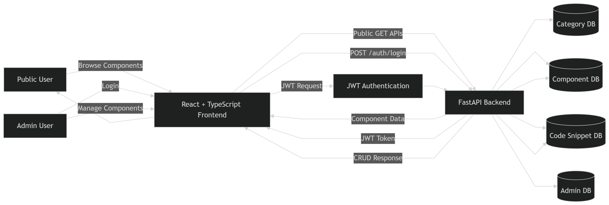

# Foundry - Enterprise Development & Deployment Starter Platform

An open-source, enterprise-grade development and deployment starter platform inspired by shadcn/ui but extended beyond UI components.


## Data Flow Architecture

<p align="center">
  
</p>

## ER - Diagram

<p align="center">
  
</p>
    

## Overview

Foundry is a central registry of reusable, production-ready code components across:
- **Frontend** - React, TypeScript, and UI patterns
- **Backend** - API design, middleware, and architecture
- **Database** - Schemas, queries, and ORM patterns
- **DevOps & Cloud** - Docker, Kubernetes, CI/CD, and cloud configurations

Each component comes with:
- Clear title and use case description
- Copy-pasteable code snippets
- Language-aware formatting
- One-click copy to clipboard functionality

## Key Features

✅ **Copy-Paste First** - Source-visible, production-ready code snippets
✅ **Enterprise-Ready** - Opinionated, best-practice patterns
✅ **Admin-Governed** - Secure authentication and component management
✅ **Public Read-Only** - Share components freely with your team
✅ **Full-Stack** - Complete React + FastAPI solution

## Architecture

### Frontend
- **Framework**: React 19 + TypeScript
- **Router**: React Router v6
- **Animation**: Framer Motion
- **Icons**: Lucide React
- **HTTP Client**: Axios
- **Styling**: CSS with white/light-red gradient theme

### Backend
- **Framework**: FastAPI
- **Database**: SQLite (PostgreSQL-compatible schema)
- **Authentication**: JWT tokens
- **ORM**: SQLAlchemy
- **Password Security**: bcrypt

### Database Models

```
Category (enum: Frontend, Backend, Database, DevOps & Cloud)
├── Component
│   ├── title (string)
│   ├── use_case (text)
│   └── CodeSnippet[]
│       ├── filename (string)
│       ├── language (string)
│       └── code (text)

Admin
├── username (string, unique)
├── email (string, unique)
├── hashed_password (string)
└── role (enum: "admin")
```

## Getting Started

### Prerequisites

- Python 3.8+
- Node.js 16+
- npm or yarn

### Installation

#### 1. Backend Setup

```bash
cd server
pip install -r requirement.txt
```

#### 2. Frontend Setup

```bash
cd client
npm install --legacy-peer-deps
```

### Running the Application

#### Start Backend (Terminal 1)

```bash
cd server
uvicorn main:app --reload --port 8001
```

The backend will be available at: `http://localhost:8001`
- API Docs: `http://localhost:8001/docs` (Swagger UI)

#### Start Frontend (Terminal 2)

```bash
cd client
npm run dev
```

The frontend will be available at: `http://localhost:5174`

## Project Structure

```
Foundry/
├── client/                    # React Frontend
│   ├── src/
│   │   ├── components/       # Layout components (Navbar, Sidebar, Footer)
│   │   ├── pages/            # Page components
│   │   │   ├── HomePage
│   │   │   ├── CategoriesPage
│   │   │   ├── ComponentDetailPage
│   │   │   ├── AuthPage (Login/Signup)
│   │   │   ├── AdminDashboardPage
│   │   │   └── AdminComponentEditorPage
│   │   ├── services/         # API client
│   │   ├── App.tsx
│   │   └── index.css         # Global styles
│   └── package.json
│
└── server/                    # FastAPI Backend
    ├── routers/
    │   ├── auth.py          # Authentication endpoints
    │   ├── admin.py         # Admin CRUD endpoints
    │   └── public.py        # Public read-only endpoints
    ├── model.py             # Database models
    ├── schemas.py           # Pydantic schemas
    ├── database.py          # Database configuration
    ├── main.py              # FastAPI app setup
    ├── requirement.txt      # Python dependencies
    └── Foundry.db           # SQLite database
```

## API Documentation

### Public Endpoints (Read-Only)

#### Categories
```
GET /api/categories
```

#### Components
```
GET /api/components                              # Get all components
GET /api/categories/{category}/components       # Get by category
GET /api/components/{component_id}              # Get component details with snippets
```

### Authentication Endpoints

```
POST /api/auth/signup          # Create admin account
POST /api/auth/login           # Admin login (returns JWT token)
GET /api/auth/me               # Get current admin info (protected)
```

### Admin Endpoints (JWT Protected)

#### Components
```
POST   /api/admin/components                       # Create component
GET    /api/admin/components                       # List all components
GET    /api/admin/components/{component_id}        # Get component details
PUT    /api/admin/components/{component_id}        # Update component
DELETE /api/admin/components/{component_id}        # Delete component
```

#### Code Snippets
```
POST   /api/admin/components/{component_id}/snippets    # Add snippet
PUT    /api/admin/snippets/{snippet_id}                 # Update snippet
DELETE /api/admin/snippets/{snippet_id}                 # Delete snippet
```

## Public User Experience

### Home Page
- Hero section explaining Foundry
- Feature highlights
- Latest components carousel
- Call-to-action buttons

### Category Pages
- Components organized by Frontend, Backend, Database, DevOps & Cloud
- Sidebar navigation
- List view with use case descriptions
- Click to view full details

### Component Detail Page
- Full component title and description
- All code snippets organized by filename and language
- One-click copy-to-clipboard functionality
- Component metadata (created, updated dates)

## Admin Experience

### Admin Login/Signup
- Secure JWT authentication
- Password strength validation
- Session management

### Admin Dashboard
- Overview of all components
- Filter by category
- Quick edit and delete actions
- Create new component button

### Component Editor
- Form-based component creation/editing
- Rich text editor for descriptions
- Multiple code snippet support
- Language selection dropdown
- Snippet preview
- Save and publish functionality

## Styling

The application uses a professional white and light-red gradient theme:
- **Primary Color**: `#ff5252` (Red Accent)
- **Light Red**: `#ffebee`
- **Background**: White to light-red gradient
- **Components**: Black text on white backgrounds

### Key Classes
- `.primary` - Primary red action button
- `.secondary` - Gray secondary button
- `.outline` - Red outline button
- `.light-red` - Light red background
- All components use Framer Motion for smooth animations

## Security Features

✅ **Admin-Only Authentication**
- JWT tokens for API protection
- Password strength requirements
- Secure password hashing with bcrypt
- Role-based access control

✅ **Public Read-Only Access**
- No authentication required for browsing
- Protected mutation endpoints

✅ **CORS Configuration**
- Configured for development environments
- Credential support for authenticated requests

## Deployment

### Docker (Coming Soon)

Dockerfile for containerization with multi-stage builds.

### Environment Variables

Create `.env` files in both `server` and `client` directories:

**server/.env**
```
SECRET_KEY=your-secret-key-here
DATABASE_URL=sqlite:///./Foundry.db
ENVIRONMENT=production
```

**client/.env**
```
VITE_API_URL=https://api.foundry.yourdomain.com
```

## Database Initialization

The database is automatically initialized on first run. To reset:

```bash
# Remove the database file
rm server/Foundry.db

# The database will be recreated on next startup
python -m uvicorn main:app --reload
```

## Sample Data

To add sample data for testing, you can create a script in the `server` directory:

```python
# server/seed_db.py
from database import SessionLocal
from model import Category, CategoryType

db = SessionLocal()

# Create default categories
for cat in CategoryType:
    Category.query.filter_by(name=cat).first() or db.add(Category(name=cat))

db.commit()
```

## Development

### Frontend Development

```bash
cd client
npm run dev      # Start dev server
npm run build    # Build for production
npm run lint     # Run ESLint
npm run preview  # Preview production build
```

### Backend Development

```bash
cd server

# Development with hot reload
uvicorn main:app --reload --port 8001

# View API documentation
# Visit: http://localhost:8001/docs
```

## Contributing

We welcome contributions! Please:

1. Fork the repository
2. Create a feature branch (`git checkout -b feature/amazing-feature`)
3. Commit your changes (`git commit -m 'Add amazing feature'`)
4. Push to the branch (`git push origin feature/amazing-feature`)
5. Open a Pull Request

## Core Principles

- **Copy-Paste First**: Source-visible, not bundled libraries
- **Production-Ready**: Enterprise-grade patterns and security
- **Admin-Governed**: Centralized content management
- **Public Consumption**: Read-only access for all
- **Clear Separation**: Frontend, Backend, Database, DevOps

## Roadmap

- [ ] Docker and Docker Compose setup
- [ ] Enhanced search functionality
- [ ] Component versioning
- [ ] Comments and ratings system
- [ ] Multi-language support
- [ ] Advanced filtering and tagging
- [ ] Component analytics
- [ ] API rate limiting
- [ ] User feedback system
- [ ] Mobile app (React Native)

## License

MIT License - See LICENSE file for details

## Support

- **Issues**: GitHub Issues
- **Discussions**: GitHub Discussions
- **Documentation**: `/docs` endpoint in API

## Inspiration

Inspired by [shadcn/ui](https://ui.shadcn.com/) and the philosophy of copy-paste-first, opinionated component libraries that empower developers.

---

**Built with ❤️ for enterprise teams**

Made to standardize internal development patterns, reduce duplication, and provide a trusted foundation for modern teams.
